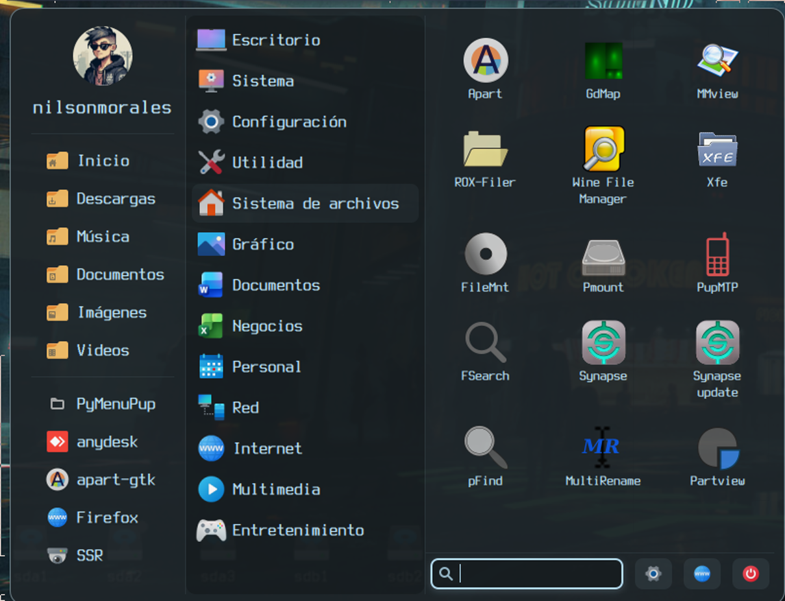
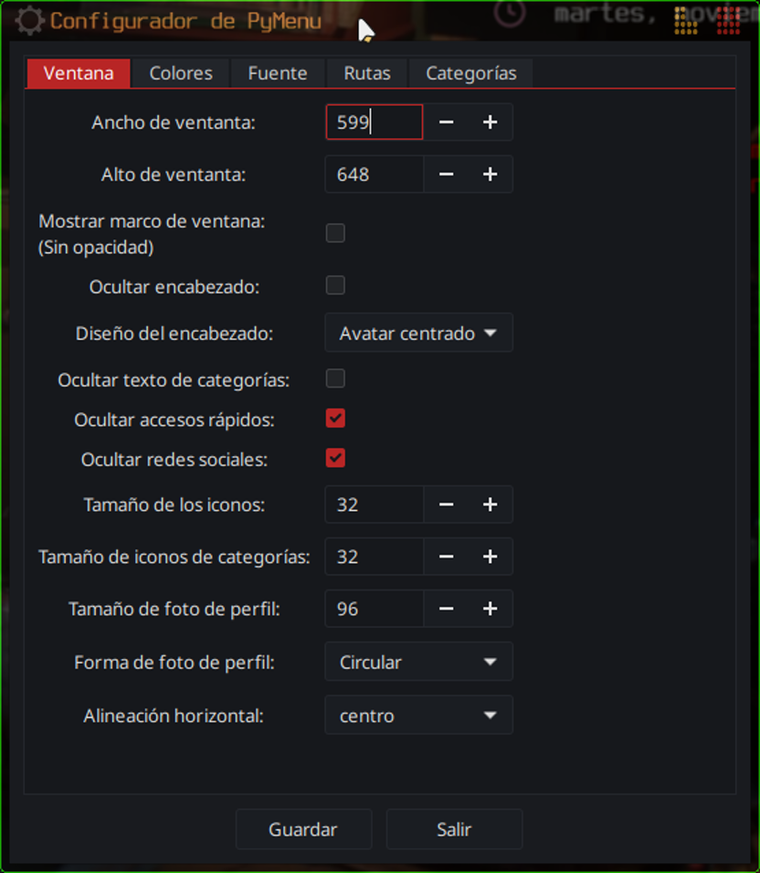

# PyMenuPup

A modern, customizable start menu for JWM (Joe's Window Manager) and Puppy Linux, written in Python with GTK3.


**English | [Español](README-es.md)**

---

## 📖 Documentation

- **[Technical Documentation](TECHNICAL.md)** - In-depth technical guide (English)
- **[Documentación Técnica](TECHNICAL-es.md)** - Guía técnica detallada (Español)

---

## Description

PyMenuPup is a modern and highly customizable start menu designed specifically for lightweight distributions like Puppy Linux that use JWM as window manager. It is also compatible with Openbox and Tint2.

### Main Features

- Fully customizable: colors, fonts, sizes and positioning
- Multilingual: support for English and Spanish
- Quick search: find applications instantly
- Quick access: system folders with one click
- Web integration: direct browser search
- Profile picture: customizable (square or circular)
- Automatic detection: support for JWM, Openbox and Tint2
- Optimized performance: lazy loading of applications
- Customizable categories: hide the ones you don't need
- Keyboard navigation: arrow keys and Enter support
- System theme integration: use GTK theme colors

---

## Components

### 1. pymenu-globicons.py
Main menu that displays all system applications organized by categories.

**Functionalities:**
- Automatic reading of JWM's `.jwmrc` file
- Intelligent application categorization
- Real-time search
- Quick access to common folders
- Social network integration
- Desktop shortcut creation *(not supported by ROX-Filer; works only with SpaceFM and related file managers)*
- Keyboard support (arrow key navigation)
- Context menu (right-click on applications)

### 2. pymenu-config.py
Graphical configuration tool to customize the menu.

**Configurable options:**
- Window dimensions and position
- Colors and transparency
- Fonts and text sizes
- File paths and commands
- Visible/hidden categories
- GTK system theme integration

---

# 🌍 Translation System

PyMenuPup uses a **simple and user-friendly translation system** based on `.lang` files.  
No complex tools like `poedit` or `gettext` are needed.

The project already includes a **ready-to-use `template.lang`**, so you only need to copy and translate it.

---

## How It Works

Translations use a plain text `key = value` format.  
You only translate the text **after the `=` sign**.

```text
# Example
Search applications... = Buscar aplicaciones...
Shutdown = Apagar
Desktop = Escritorio
```

If a line is left empty, PyMenuPup will automatically use English.

---

## Translation Files Location

Translation files are searched in this order (highest priority first):

1. `~/.config/pymenupup/locale/` — **User translations** (recommended)
2. `/usr/local/share/locale/pymenupup/`
3. `/usr/share/locale/pymenupup/` — System-wide

> **Tip:** Using the user folder avoids modifying system files.

---

## Supported Languages

- **English (en)** — Built-in (no file needed)
- **Spanish (es)** — `es.lang` included
- **French (fr)** — `fr.lang` included

More languages can be added easily.

---

## Creating a New Translation (Recommended)

### 1. Copy the template file and rename it using your language code:

```bash
template.lang → es.lang
```

**Examples:**
- `fr.lang` — French
- `de.lang` — German
- `pt.lang` — Portuguese

### 2. Open the file with any text editor.

### 3. Translate only the text on the right side of `=`:

```text
PyMenuPup Configurator = Configurador de PyMenuPup
Window = Ventana
Colors = Colores
Font = Fuente
```

### 4. Save the file and restart PyMenuPup.

**That's it! 🎉** No Python code changes required.

---

## Regional Variants

Regional language files are supported, for example:

- `es-MX.lang` — Spanish (Mexico)
- `es-AR.lang` — Spanish (Argentina)
- `fr-CA.lang` — French (Canada)
- `pt-BR.lang` — Portuguese (Brazil)

If a regional file is not found, PyMenuPup will automatically fall back to the base language (for example `es.lang`).

---

## Example Translation Workflow

1. **Create your language directory:**
   ```bash
   mkdir -p ~/.config/pymenupup/locale
   ```

2. **Copy the template:**
   ```bash
   cp template.lang ~/.config/pymenupup/locale/es.lang
   ```

3. **Edit and translate:**
   ```bash
   nano ~/.config/pymenupup/locale/es.lang
   ```

4. **Restart PyMenuPup** and your language will be automatically detected!

---

## Contributing Translations

If you create a translation for a new language, consider contributing it back to the project:

1. Fork the repository
2. Add your `.lang` file to the `locale/` directory
3. Submit a pull request
---

### Category Name Mapping

The translation system automatically handles category names in JWM menus. If your JWM has categories in your language (e.g., "Bureau" in French), PyMenuPup will automatically map them to the standard English names internally while displaying them in your language.

--- 

## Distribution Variants

PyMenuPup has different versions optimized for different Linux environments:

### Original Version (Puppy Linux)
The main version (`pymenu-globicons.py` and `pymenu-config.py`) is designed specifically for Puppy Linux, which:
- Runs the system as root user by default
- Does not require the use of `sudo` for system operations
- Has Puppy Linux specific paths and configurations

### EasyOS Compatibility
This main version is also compatible with EasyOS by Barry Kauler, since:
- EasyOS also runs as root by default
- Uses a frugal layered filesystem similar to Puppy Linux
- System paths and environment behave closely to Puppy-based systems
No modifications are required to run the Puppy Linux version inside EasyOS.

### Versions for Standard Linux Distributions

In the `distro-linux/` folder you will find versions adapted for other Linux distributions that use non-root users:

#### **Essora** (`distro-linux/Essora/`)
Modified version for standard Linux distributions (Debian, Ubuntu, Arch, Fedora, etc.) with the following changes:

- **Permission management**: Proper use of `sudo` for operations requiring elevated privileges
- **Adapted paths**: Configurations adjusted for standard user directory structures
- **System commands**: Adaptation of shutdown, reboot and lock commands for multi-user systems
- **Environment variables**: Correct handling of `$HOME` and `$USER` for non-root users

#### **Trixiepup64** (`distro-linux/Trixiepup64/`)
Specialized version for Trixiepup64 (Wayland + labwc compositor) with the following features:

- **Wayland compatibility**: Optimized for Wayland display server instead of X11
- **labwc integration**: Native support for labwc compositor (Openbox-like for Wayland)
- **Openbox menu parser**: Reads and parses `menu.xml` from Openbox/labwc format
- **Wayland-specific commands**: Adapted system commands for Wayland environment
- **Menu.xml structure**: Compatible with standard Openbox menu structure used by labwc's menu generator

**When to use each version?**
- **Use the main version** if you are on Puppy Linux or derivatives
- **Use the Essora version** if you are on Debian, Ubuntu, Arch, Fedora, Mint or other standard distributions
- **Use the Trixiepup64 version** if you are on Trixiepup64 or any Wayland-based system using labwc compositor

---

## Dependencies

### System Requirements

```
Python 3 (>= 3.6)
python3-gi
gir1.2-gtk-3.0
gir1.2-gdk-3.0
gir1.2-gdkpixbuf-2.0
gir1.2-pango-1.0
gir1.2-gio-2.0
gir1.2-glib-2.0
xdg-utils
Nerd Fonts
```

### Installing Dependencies

#### On Puppy Linux:
```bash
# Puppy Package Manager (PPM) usually includes python3-gi
# Verify that you have it installed:
python3 --version
python3 -c "import gi; print('GTK3 OK')"
```

#### On Debian/Ubuntu:
```bash
sudo apt update
sudo apt install python3 python3-gi python3-gi-cairo gir1.2-gtk-3.0 xdg-utils
```

#### On Arch Linux:
```bash
sudo pacman -S python python-gobject gtk3 xdg-utils
```

#### On Fedora/RHEL:
```bash
sudo dnf install python3 python3-gobject gtk3 xdg-utils
```

---

## Installation

### Manual Installation

1. Clone the repository:
```bash
git clone https://github.com/your-username/PyMenuPup.git
cd PyMenuPup
```

2. Copy the scripts to the system:
```bash
sudo cp pymenu-globicons.py /usr/local/bin/
sudo cp pymenu-config.py /usr/local/bin/

# Give execution permissions
sudo chmod +x /usr/local/bin/pymenu-globicons.py
sudo chmod +x /usr/local/bin/pymenu-config.py
```

3. Copy translation files:
```bash
sudo mkdir -p /usr/share/locale/pymenupup
sudo cp locale/*.lang /usr/share/locale/pymenupup/
sudo chmod 644 /usr/share/locale/pymenupup/*.lang
```

4. Create symbolic links (optional):
```bash
sudo ln -s /usr/local/bin/pymenu-globicons.py /usr/local/bin/pymenu
sudo ln -s /usr/local/bin/pymenu-config.py /usr/local/bin/pymenu-config
```

## 🛠️ Building from Source (Using Nuitka on Puppy Linux / EasyOS)

This project allows you to compile Python scripts into highly optimized `.bin` binaries using **Nuitka**, a Python-to-C compiler.  
Below you'll find what it is, where to get it, and how to use it on Puppy/EasyOS.

---

### 🧩 What is Nuitka?

**Nuitka** is a true Python compiler written in C++.  
It takes your `.py` scripts and converts them into:
- **Native executables** (binaries)
- Faster performance
- Lower CPU usage
- No Python installation required to run them

It's ideal for distributing applications on Puppy Linux because it:
- Reduces program size
- Eliminates external dependencies
- Improves startup speed
- Better protects source code

---

### 🌐 Where to Get Nuitka?

You can download it directly from the official website:
- Website: https://nuitka.net  
- Downloads: https://nuitka.net/pages/download.html  
- GitHub: https://github.com/Nuitka/Nuitka

On Puppy/EasyOS, it's common to download it to the `/root/` folder:

Example:
```
/root/Nuitka-2.9rc5/
```

Inside you'll find the compilation binary:
```
/root/Nuitka-2.9rc5/bin/nuitka
```

---

### 🔧 1. Install Required Dependencies (Puppy Linux / EasyOS)

To compile, you need to activate the development environment.

**Load devx.sfs:**

Menu → Setup → SFS-Load-on-the-fly → devx.sfs

The `devx` includes:
- gcc
- make
- libc-dev
- Python.h and other necessary headers

Additionally, install these packages:
- patchelf
- python3-zstandard
- python3-dev

If your Puppy/EasyOS supports `apt`:
```bash
apt install patchelf python3-zstandard python3-dev
```

#### For Fossapup64 9.5

Thanks to user **Burunduk** for testing on Fossapup64. To run PyMenu on a fresh Fossapup-9.5 installation:

1. Open PPM (Puppy Package Manager)
2. Update the database (~16 MB download)
3. Search for and install `meld_3.20.2` and its dependencies (~3 MB, use auto-install mode)
4. Run PyMenu - it should now work

**Note:** Meld is a small GUI diff tool that provides the necessary GTK dependencies and can be useful on its own.

---

### ⚙️ 2. Compile Scripts Using Nuitka

Example compilation for `pymenu-globicons.py`:
```bash
python3 /root/Nuitka-2.9rc5/bin/nuitka \
    --mode=onefile \
    --follow-imports \
    --lto=yes \
    --static-libpython=no \
    --plugin-enable=gi \
    --nofollow-import-to=tkinter \
    --nofollow-import-to=unittest \
    --nofollow-import-to=pydoc \
    --nofollow-import-to=*.tests \
    --experimental=use_upx \
    /usr/local/bin/pymenu-globicons.py
```

The generated executable will appear as:
```
pymenu-globicons.bin
```

You can rename it (remove the `.bin` extension) and move it to `/usr/local/bin`:
```bash
mv pymenu-globicons.bin /usr/local/bin/pymenu-globicons
chmod +x /usr/local/bin/pymenu-globicons
```

---

### 📝 3. Recommended Nuitka Options

| Option | Description |
|--------|-------------|
| `--mode=onefile` | Creates a single executable file |
| `--lto=yes` | Link-time optimization for size and performance |
| `--static-libpython=no` | Produces smaller binaries |
| `--follow-imports` | Includes necessary dependencies |
| `--experimental=use_upx` | Additional compression (if UPX is available) |

---

### 💡 Tips

- The first compilation may take several minutes
- Compiled binaries are significantly faster than Python scripts
- Ensure all Python dependencies are installed before compiling
- Test the binary after compilation to verify functionality

## Configuration

### First Run

When running PyMenuPup for the first time, a configuration file will be automatically created at:

```
~/.config/pymenu.json
```

### Configuring JWM

Edit your `~/.jwmrc` file and add:

```xml
<Program label="Menu" icon="applications-system">
    /usr/local/bin/pymenu-globicons.py
</Program>
```

Or to use with specific coordinates:

```xml
<Program label="Menu" icon="applications-system">
    /usr/local/bin/pymenu-globicons.py 100 100
</Program>
```

In PuppyLinux /root/.jwmrc:

```xml
<RootMenu label="Menu" labeled="false" height="24" onroot="3">
```
then /root/.jwmrc-tray

```xml
 <TrayButton label="[MENU]" popup="Open menú">exec:pymenu-globicons.py</TrayButton>
```

### Configuring with Tint2

If you use Tint2, edit `~/.config/tint2/tint2rc`:

```ini
# Launcher
launcher_item_app = /usr/local/bin/pymenu-globicons.py
```
---

## External Tools (Optional)

PyMenu can integrate with external tools for extended functionality. These tools are **not included** in this project and are completely optional:

### Profile Manager
- A custom tool to configure your profile picture
- Configure the path in: **Settings > Paths > Profile manager**
- PyMenu will work without this tool

### Shutdown Dialog
- A custom shutdown/logout interface
- Configure the path in: **Settings > Paths > Shutdown command**
- PyMenu will work without this tool

**Note:** Users can specify their own custom tools or scripts for these features. The paths in the configuration are examples and should be adjusted to your system.

---

## Usage

### Running the Menu

```bash
# Basic execution
pymenu-globicons.py

# With custom position (x, y)
pymenu-globicons.py 100 100

# With custom JWM file
pymenu-globicons.py /path/to/jwmrc
```

### Opening the Configurator

```bash
pymenu-config.py
```

Or from the main menu, click on the configuration icon.

### Keyboard Shortcuts

- **Esc**: Close the menu
- **Alt + Left Click**: Move the window
- **Middle Click (wheel)**: Close the menu
- **Arrow Keys**: Navigate through applications
- **Enter**: Launch selected application
- **Right Click on app**: Context menu

---

## File Structure
```
PyMenuPup/
├── README.md                  # Main readme (English)
├── README-es.md               # Readme (Spanish)
├── TECHNICAL.md               # Technical documentation (English)
├── TECHNICAL-es.md            # Technical documentation (Spanish)
├── pymenu-globicons.py        # Main menu
├── pymenu-config.py           # GTK configurator
├── pymenupuplang.py           # Translation system
├── distro-linux/             # Distro-specific configurations
│   ├── Essora/
│   │   ├── Pymenu-essora.py
│   │   ├── pymenu-config-essora.py
│   │   └── pymenupuplang.py
│   └── Trixiepup-Wayland/
│       └── Pymenu-trixiewayland.py
├── locale/                   # Translations
│   ├── ar.lang                # Arabic
│   ├── de.lang                # German
│   ├── es.lang                # Spanish
│   ├── fr.lang                # French
│   ├── it.lang                # Italian
│   ├── ja.lang                # Japanese
│   ├── pt-BR.lang             # Portuguese (Brazil)
│   ├── pt-PT.lang             # Portuguese (Portugal)
│   ├── ru.lang                # Russian
│   └── template.lang          # Base template
└── screenshots/              # Screenshots
├── config-tool.png
└── main-menu.png
```

### Installation Paths
```
/usr/local/bin/
├── pymenu-globicons.py       # Main menu executable
├── pymenu-config.py          # Configurator executable
└── pymenupuplang.py          # Translation module

/usr/share/locale/pymenupup/
├── es.lang                   # Spanish translation
└── fr.lang                   # French translation

~/.config/pymenupup/
├── pymenu.json              # Main configuration
└── locale/                  # User custom translations (optional)
    └── es-custom.lang

```

### User Configuration Files

```
~/.config/
├── pymenu.json              # Main configuration
└── tint2/
    └── tint2rc              # Tint2 config (if applicable)

~/
├── .jwmrc                   # JWM config
├── .jwmrc-tray             # JWM tray config
└── .face                    # Profile picture
```

---

## Advanced Customization

### Manually Editing Configuration

The `~/.config/pymenu.json` file has this structure:

```json
{
    "window": {
        "width": 700,
        "height": 850,
        "decorated_window": false,
        "hide_header": false,
        "hide_quick_access": false,
        "hide_social_networks": false,
        "hide_category_text": false,
        "halign": "center",
        "icon_size": 32,
        "category_icon_size": 16,
        "profile_pic_size": 128,
        "profile_pic_shape": "square",
        "header_layout": "left"
    },
    "font": {
        "family": "Sans 12",
        "size_categories": 12000,
        "size_names": 10000,
        "size_header": 8000
    },
    "colors": {
        "use_gtk_theme": false,
        "background": "rgba(0, 0, 0, 0.7)",
        "border": "rgba(255, 255, 255, 0.1)",
        "text_normal": "#D8DEE9",
        "text_header_os": "#D8DEE9",
        "text_header_kernel": "#D0883A",
        "text_header_hostname": "#88C0D0",
        "hover_background": "rgba(255, 255, 255, 0.1)",
        "button_normal_background": "rgba(0,0,0,0.6)",
        "button_text": "#ECEFF4",
        "categories_background": "rgba(0,0,0,0.6)",
        "use_gtk_theme": true
    },
    "paths": {
        "profile_pic": "/root/.face",
        "profile_manager": "/usr/local/bin/ProfileManager.py",
        "shutdown_cmd": "/usr/local/bin/apagado-avatar.py",
        "jwmrc_tray": "/root/.jwmrc-tray",
        "tint2rc": "/root/.config/tint2/tint2rc"
    },
    "tray": {
        "use_tint2": false
    },
    "categories": {
        "excluded": []
    }
}
```

### Adding Custom Icons

PyMenuPup searches for icons in these paths:
- `/usr/local/lib/X11/pixmaps`
- `/usr/share/pixmaps`
- `/usr/share/icons/hicolor/*/apps`
- `/usr/share/pixmaps/puppy`

Place your icons in any of these folders.

### Excluding Categories

Edit the configuration file to hide specific categories:

```json
"categories": {
    "excluded": ["Help", "Leave", "Rectify"]
}
```

---

## Troubleshooting

### Menu doesn't appear

```bash
# Verify that Python3 is installed
python3 --version

# Verify GTK dependencies
python3 -c "import gi; gi.require_version('Gtk', '3.0'); from gi.repository import Gtk; print('GTK OK')"
```

### Icons not showing

```bash
# Verify icon paths in your .jwmrc
grep IconPath ~/.jwmrc

# Reinstall icon package
# (in Puppy Linux it's usually included)
```

### Incomplete menu or missing entries
If your .jwmrc contains malformed XML, the menu may fail to load fully.
Even commented sections can break parsing if the tags are not properly closed.

Example of an incorrect comment:

```xml
\<!-- unclosed comment 
```

### Permission errors

```bash
# Make sure scripts are executable
chmod +x /usr/local/bin/pymenu-globicons.py
chmod +x /usr/local/bin/pymenu-config.py
```

### Menu closes immediately

```bash
# Run from terminal to see errors
python3 /usr/local/bin/pymenu-globicons.py
```

### Profile picture not loading

```bash
# Verify the profile picture exists
ls -la ~/.face

# Or check the configured path
grep profile_pic ~/.config/pymenu.json
```

---

## Contributing

Contributions are welcome! If you want to improve PyMenuPup:

1. Fork the repository
2. Create a branch for your feature (`git checkout -b feature/AmazingFeature`)
3. Commit your changes (`git commit -m 'Add some AmazingFeature'`)
4. Push to the branch (`git push origin feature/AmazingFeature`)
5. Open a Pull Request

---

## License

This project is licensed under the GPL v3 License. See the `LICENSE` file for more details.

---

## Author

Nilson Morales
- GitHub: [@woofshahenzup](https://github.com/Woofshahenzup)
- Forum: [Puppy Linux Forum](https://forum.puppylinux.com)

---

## Acknowledgments

- The Puppy Linux team for creating such a lightweight and efficient distribution
- Joe Wingbermuehle for JWM (Joe's Window Manager)
- The GTK and Python communities
- All project contributors

---

## Screenshots and Demo

### Screenshots



### Video Demo
[](https://www.youtube.com/watch?v=CV71anlLqe8)
*Click to watch the full demo on YouTube*

---

## Useful Links

- [Puppy Linux Official](https://puppylinux.com)
- [JWM Documentation](http://joewing.net/projects/jwm/)
- [GTK3 Documentation](https://docs.gtk.org/gtk3/)
- [Python GObject Documentation](https://pygobject.readthedocs.io/)

---

**Do you like PyMenuPup? Give the repository a star!**
